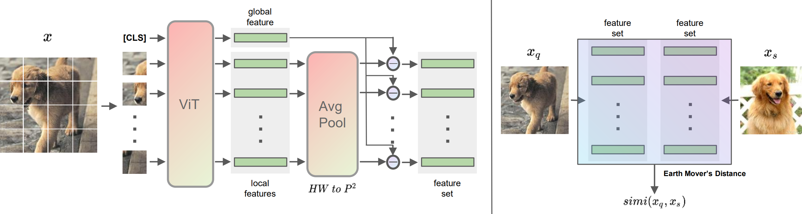
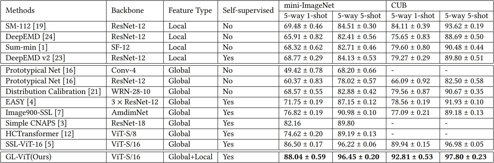

# GL-ViT

This repository contains the code for [Global and Local Feature Interaction with Vision Transformer for Few-shot Image Classification](https://dl.acm.org/doi/10.1145/3511808.3557604).



## Citation

```
@inproceedings{DBLP:conf/cikm/SunML22,
  author    = {Mingze Sun and
               Weizhi Ma and
               Yang Liu},
  title     = {Global and Local Feature Interaction with Vision Transformer for Few-shot
               Image Classification},
  booktitle = {Proceedings of the 31st {ACM} International Conference on Information
               {\&} Knowledge Management, Atlanta, GA, USA, October 17-21, 2022},
  pages     = {4530--4534},
  publisher = {{ACM}},
  year      = {2022},
  url       = {https://doi.org/10.1145/3511808.3557604},
  doi       = {10.1145/3511808.3557604},
}
```

## Introduction

Image classification is a classical machine learning task and has been widely used in various scenarios. While due to the high costs of annotation and data collection in applications, few-shot learning has become a vital technique to improve image classification performances. However, most existing few-shot image classification methods only focus on modeling the global image feature or image local patches, which ignore the global-local interactions of images. In this study, we propose a new method, named GL-ViT, to integrate both global and local features to fully exploit the few-shot samples for image classification. Firstly, we design a feature extractor module to calculate the interactions between the global representation and local patch embeddings, where ViT is also adopted to achieve efficient and effective image representation. Then, Earth Mover’s Distance is adopted to measure the similarity between two images. Abundant Experimental results on several widely-used open datasets show that GL-ViT outperforms state-of-the-art algorithms significantly, and our ablation studies also verify the effectiveness of both global-local features.

## Main Results



## Usage

### Preliminaries

#### Environment

- python 3.7
- Further requirements are listed in `requirements.txt`

#### Datasets

Experiments are conducted on mini-ImageNet and CUB, which can be downloaded following instructions from [FRN](https://github.com/Tsingularity/FRN).

#### Pretrained ViT parameters

Vision transformer is pretrained on ImageNet in the framework of [DINO](https://doi.org/10.1109/ICCV48922.2021.00951).

Since mini-ImageNet is a subset of ImageNet, classes in mini-ImageNet are excluded in pretraining of ViT. See [SSL-ViT](https://github.com/AutoVision-cloud/SSL-ViT-lowlabel-highdata) for details.

Pretraining checkpoints for mini-ImageNet and CUB can be downloaded from [mini_imagenet_checkpoint.pth](https://drive.google.com/file/d/1kXdqIR15fYKANx97blXVm8Fbwiz-FTvF/view?usp=sharing) and [dino_deitsmall16_pretrain.pth](https://dl.fbaipublicfiles.com/dino/dino_deitsmall16_pretrain/dino_deitsmall16_pretrain.pth).

### Training and Evaluation for GL-ViT

Important configs `dataset`, `data_path`, `shot_num`, `pretrained_weights`, `NUM_PATCH` and `FEATS` can be modified in `src/entry.py`.

- `dataset`: which dataset to be evaluated.
- `data_path`, `pretrained_weights`: path of datasets and pretrained checkpoints.
- `shot_num`: shot number. usually 1 or 5.
- `NUM_PATCH`: patch number. Hyper-parameter study shows that 4 is the best.
- `FEATS`: which feature(s) are used. Can be `global-local-minus`, `local-only` or `global-only`.

```
cd src; python entry.py
```
